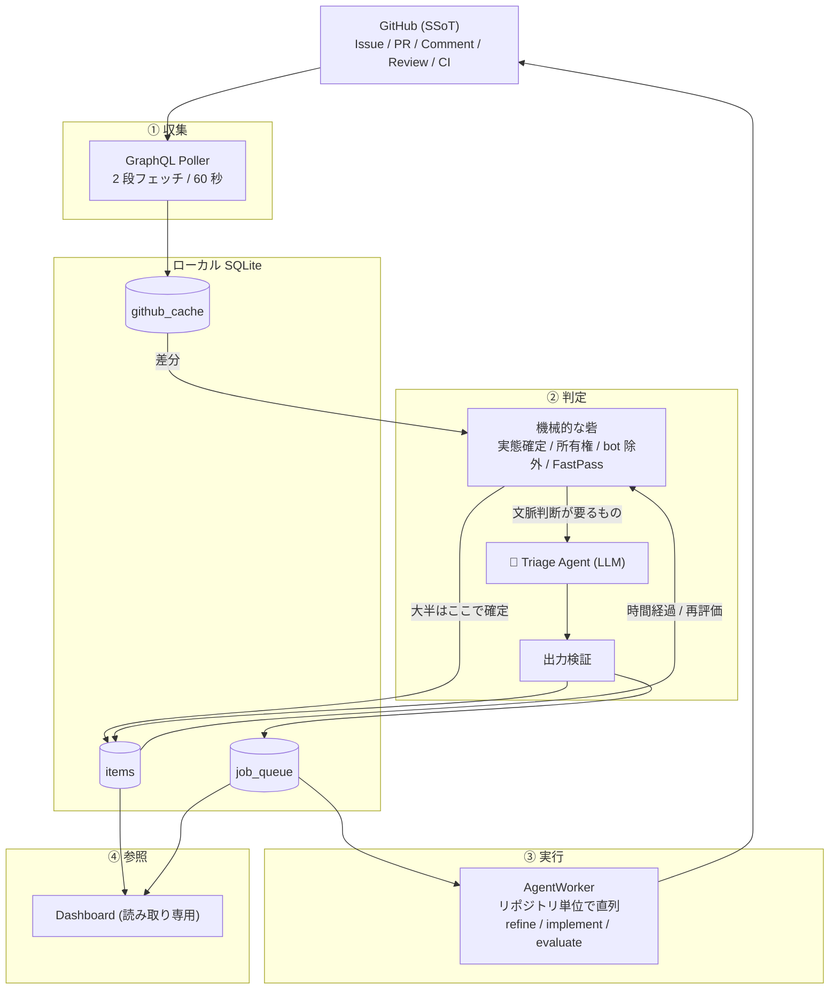

# 実装アーキテクチャ

[DESIGN.md](./DESIGN.md) の「何を実現するか（What）」を、どう作るか（How）に落とすための**方針**を定める。

本書は思想だけを書く。実装に要る決定は [docs/spec.md](./docs/spec.md)、外部制約は [docs/constraints.md](./docs/constraints.md)、
スキーマ・クエリ・設定は `schema.sql` / `queries.graphql` / `config.example.yaml` を正本とする。

---

## 1. 10 の方針

### 1. GitHub が真実源、ローカル DB はキャッシュとキューにすぎない
`items` や `github_cache` を消しても、GitHub を読み直せば状態は再構築できる。ローカルにしか無い情報を作らない。
これにより、人間がブラウザで Issue を勝手にクローズしても、DB を消して作り直しても、システムは正しい状態に収束する。

### 2. SQLite を挟んで、各ステージを疎結合にする
「収集」「判定」「実行」「参照」を DB 越しにつなぎ、互いを直接呼ばない。
どれか 1 つが落ちても他は動き続け、再起動すれば DB の続きから再開できる。

### 3. Webhook ではなくポーリングを採る
ローカル常駐型に公開エンドポイントは用意できない。リポジトリごとの runner 登録も不要にしたい（DESIGN 原則7）。
代わりに GraphQL の 2 段フェッチでコストを落とす。

### 4. 「次に何をすべきか」の判断は LLM に委ねる
状態とイベントの組み合わせを網羅するマトリクスを持たない。**過去のバージョンはこれで破綻した。**
「Phase × イベント」の表は、PR レビューの種類、親子の進行状況、承認とも要望ともつかないコメント、といった現実の入力に対して行が増え続け、
条件分岐の管理が破綻し、表に無い組み合わせが無言で捨てられるようになった。

そこで「今どういう状況で、次に何をすべきか」の判断そのものを Triage Agent（LLM）に渡す。
GitHub のスナップショット（Issue 本文・コメント履歴・PR・レビュー・CI・親子関係）を見せて、状態と次のジョブを決めさせる ➔ [docs/spec.md](./docs/spec.md)

### 5. ただし LLM を信用はしない
判断を委ねることと、出力をそのまま適用することは別である。LLM の手前と後ろの両方に機械的な砦を置く。

- **手前**: GitHub の実態で確定できるもの（Closed / Merged / CI の結果）は LLM を呼ばずに機械的に決める。実行中ジョブがあるアイテムは判定自体を保留する。
- **手前**: 最頻出の「OK」だけは FastPass で素通しする（LLM 消費 0）。ただし状態と子の有無でガードする。
- **後ろ**: 出力は値域・整合性・GitHub 実態との矛盾を検証してから反映する。矛盾したら**実態を優先**する。

コスト・レイテンシのためだけでなく、**LLM の判定が揺れても状態が壊れないようにする**ための構造である。

### 6. 状態は 4 つしか持たない
`ActionRequired` / `Working` / `Queued` / `Done`。人間から見て「自分の手番か、そうでないか」だけが本質であり、それ以外は区別しない。
スタック・CI 停滞・リトライ上限超過はすべて「人間の判断待ち」であって、独立した状態ではない。細かい区別は表示用のヒント文字列で行う ➔ [docs/spec.md](./docs/spec.md)

### 7. 同一リポジトリのジョブは必ず 1 件ずつ
Git のワークツリーは 1 つしか無い。同時に 2 つのエージェントが触れば壊れる。
直列化の単位はリポジトリであり、別リポジトリは並列に走ってよい。
なお **CI 待ちはキューを占有しない**（プロセスを持たないため）。これが「3 件まとめて指示して裏で消化させる」を成立させている ➔ [docs/spec.md](./docs/spec.md)

### 8. エージェントの `exit 0` を信用しない
何もせずに正常終了するエージェントは実在する。**GitHub 側に成果物（PR / コメント / `head_sha` の変化）があることを確認して初めて成功とみなす** ➔ [docs/spec.md](./docs/spec.md)

### 9. `items` の各列の書き手は 1 つ
Poller・Dispatcher・AgentWorker が同じ行を触る。「誰が書くか」を列ごとに固定しないと、
片方が書いた値をもう片方が古いスナップショットで上書きする。**過去のレビューで最も多く出た欠陥がこの形だった。**
書き手が複数になる列は、所有権ルールと楽観ロック（`version`）で排他する ➔ [docs/spec.md](./docs/spec.md)

### 10. 決定と実行に時間差があるものは、使う瞬間に再検証する
キューは直列なので、ジョブを積んだ時点と実行する時点の間に数十分空くことがある。
その間に GitHub 側は動く。**積んだときの前提を実行時にもう一度確かめる。**
`evaluate` が「CI が通った commit」ではなく「今の HEAD」を評価してしまうのがこの形である ➔ [docs/spec.md](./docs/spec.md)

---

## 2. 全体像



| ステージ | 責務 | 詳細 |
|---|---|---|
| **① 収集** | 変更を最小コストで検知し、変化したアイテムだけ詳細を取得してキャッシュする | [docs/spec.md](./docs/spec.md) |
| **② 判定** | 「今どういう状況で、次に何をすべきか」を決め、`items` を更新して `job_queue` に積む | [docs/spec.md](./docs/spec.md) / [docs/spec.md](./docs/spec.md) |
| **③ 実行** | キューから直列にジョブを取り、エージェントを起動し、成果物を GitHub 側で検証する | [docs/spec.md](./docs/spec.md) / [docs/spec.md](./docs/spec.md) |
| **④ 参照** | `items` と `job_queue` を 3 レーンで見せる。書き込み API は持たない | [docs/spec.md](./docs/spec.md) |

判定の入口は 2 つある。**GitHub 側が動いたとき**（キャッシュの差分）と、**時間だけが経ったとき**（Tick）である。
CI が固まったまま何も変化しないケースは前者では永久に発火しないため、後者が必要になる。

---

## 3. エージェントに任せる 3 つのジョブ

| ジョブ | 役割 | 終わったら |
|---|---|---|
| `refine` | 1 行の Issue から背景・受け入れ条件を書き起こす。大きすぎれば子 Issue に分割する | 人間に確認を求める |
| `implement` | ブランチを切って実装・テスト・PR 作成、または既存 PR の修正 push | CI を待つ |
| `evaluate` | CI 通過後に品質ゲートとコード品質を評価する | 合格なら人間にマージを求め、不合格なら人間を呼ばずに `implement` へ差し戻す |

- **合否は結果ファイルで受け渡す**。GitHub のコメント本文に機械可読なマーカーを埋め込まない。コメントは人間が読むためだけのものにする。
- **品質基準はリポジトリ側に置く**（`.agents/autopilot-gate.md`）。 ➔ [docs/spec.md](./docs/spec.md)
- **エージェントに与えない権限**: PR をマージしない / Issue を閉じない / 既定ブランチへ直接 push しない（DESIGN 原則9）。

---

## 4. Dashboard は読むだけ

承認・指示・マージはすべて GitHub 側で行う。Dashboard に承認ボタンを置くと、**GitHub のコメント履歴に残らない指示経路**が生まれ、真実源が二重化する（方針1 に反する）。
スマホからの操作は GitHub Mobile が担うので、同等の機能を持たせる必要もない。

操作は GitHub 上で完結する。ジョブはタイムアウト（`refine` 15 分, `implement` 60 分, `evaluate` 30 分）およびリトライ上限（5 回）により確実に停止するため、手動中止のコマンドは設けない。

パイプラインが静かに止まると「Action Required 0 件」が平穏に見えてしまうため、レートリミット待機やポーリング停止は常時バナーで可視化する ➔ [docs/spec.md](./docs/spec.md)

---

## 5. CLI

```sh
autopilot run                      # 常駐（収集・判定・実行・Dashboard）。多重起動は不可
autopilot status                   # ターミナルで手番・自走中・キューを表示
autopilot doctor                   # 設定と接続性を起動前に検証する
```

`doctor` は「実行時になって初めて失敗する」類の設定ミスを事前に潰すためにある。
特に **bot アカウントの取り違え**（人間のトークンで動かすと自己トリガーの無限ループになる）は、検出したら起動を拒否する ➔ [docs/spec.md](./docs/spec.md)

初回起動時は**シードのみを行い、Triage もジョブ投入も一切しない**。導入前から存在する Open Issue すべてに `refine` が一斉発火するのを防ぐ ➔ [docs/spec.md](./docs/spec.md)

---

## 6. 実装スタック

- **言語・ランタイム**: TypeScript on **Bun**
- **DB ドライバ**: `bun:sqlite`（WAL モード、`RETURNING` 完全対応、同期高速処理）
- **Web / API**: **Hono**（HTTP サーバ、同一常駐プロセス内に同居）
- **プロセス排他ロック**: `O_EXCL` ロックファイル（`$AUTOPILOT_HOME/autopilot.lock` に PID と `boot_id` を書き込み、ファイルが既に存在する場合は `process.kill(pid, 0)` で生存確認・回収）
- **バイナリ配布**: `bun build --compile` による単一スタンドアロンバイナリ生成（React SPA 資産を内蔵し、Nix パッケージ / derivation による配布に対応）

---

## 7. ドキュメント一覧

| ファイル | 役割 |
|---|---|
| [DESIGN.md](./DESIGN.md) | 前提。ユーザーストーリーとシナリオ（**何を実現するか**） |
| ARCHITECTURE.md | 本書。10 の方針と全体像（**なぜそう作るか**）。細部を決めるときはこの 10 項目とだけ照合する |
| [docs/constraints.md](./docs/constraints.md) | 実測で確かめた外部制約（GitHub API / LLM / Git）。再取得コストが高いので残す |
| [docs/spec.md](./docs/spec.md) | 実装に要る決定だけ（**巻き戻しコストが高いもの**）。閾値やエッジケースは実装時に決める |
| `src/` / `config.example.yaml` | 実装。スキーマ・クエリ・閾値の正本はコード側にあり、散文で二重に持たない |

> **ディレクトリは §2 の 4 ステージに 1:1 で対応する。**
> `src/collect`（① 収集）/ `src/decide`（② 判定）/ `src/execute`（③ 実行）/ `src/view`（④ 参照）。
> 横断的な基盤は `src/store`（SQLite）と `src/github`（API）。値域は `src/types.ts` に閉じている。
>
> **チョークポイント**（方針9・10 をコードで強制する場所。ここ以外に同じ判断を書かない）:
> `store/items.ts` の `transitionItem()` … `items` の唯一の遷移点。値域検証・楽観ロック・`Done` ガード
> `store/jobs.ts` の `enqueueJob()` / `fetchNextJob()` … 二重投入の抑止と直列フェッチ
> `decide/sync.ts` … 強制同期の順序付きリスト（first-match）
> `decide/ci.ts` の `decideCiAction()` … CI 判定。`ci_since IS NULL` の除外もここだけ
> `github/poll.ts` … Phase 1 クエリと fingerprint 算出を同居させ、片方だけの更新を防ぐ

> **書かないもの**: 理由づけはチョークポイントのコードコメントに書く。判断の瞬間に読まれる場所に置くため。
> エッジケースは実装して実際に踏んでから足す（[docs/spec.md §11](./docs/spec.md)）。

---

## 8. 用語対応表

| 日本語表記 / 概念 | 英語 / コード上の識別子 | 定義・役割 |
|---|---|---|
| **要求の精緻化** | `refine` | Issue の背景・目的・受け入れ条件を整理し確認を求めるジョブ |
| **実装** | `implement` | コード修正・ローカルテスト・PR 作成 / 修正 push を行うジョブ |
| **品質評価** | `evaluate` | CI 通過後に品質ゲートに照らして合否判定を行うジョブ |
| **切り分け** | `triage` / `Triage Agent` | 更新検知時に次の状態とジョブを純関数的に判定する軽量エージェント |
| **助言待ち** | `blocked` / `display_hint = '助言待ち'` | エージェントが自力解決不能で人間の選択肢回答を待つ状態 |
| **マージ待ち** | `display_hint = 'マージ待ち'` | CI および `evaluate` が合格し人間のマージ判断を待つ状態 |
| **手番（要対応）** | `ActionRequired` | 人間の入力・判断・確認が必要な 4 大状態の 1 つ |
| **自走中** | `Working` | エージェント実行中・CI 待ち・子タスク進行中の 4 大状態の 1 つ |
| **着手待ち** | `Queued` | 承認済みで直列キューに積まれている 4 大状態の 1 つ |
| **完了** | `Done` | マージまたはクローズされた 4 大状態の 1 つ |
