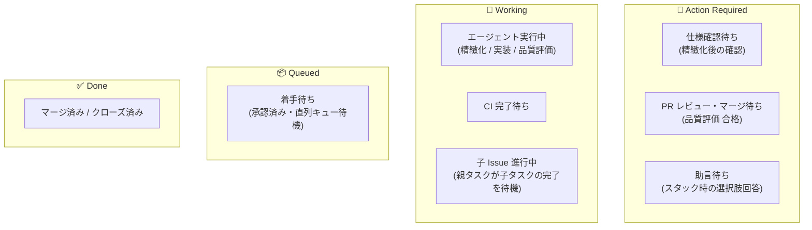

# 自動開発パイプライン設計

GitHub（Issue / PR）を SSoTとし、人間は「スマホやスキマ時間から最小限のコメントを返す」「時間が空いたときに Dashboard で状況を把握して決裁する」「最終マージを判断する」だけに集中し、それ以外（要件精緻化・実装・テスト・セルフレビュー・CI検証・品質評価）は自律エージェントが裏で自走して高回転で消化するパイプラインを設計する。

---

## 1. 背景と個人開発の前提条件

個人開発における最大の制約は **「時間の少なさ」** と **「判断力（ウィルパワー）の消耗」** である。

- 机の前に座ってじっくり開発する時間は限られている。
- 電車での移動中、ベッドの中、仕事の合間などの **スキマ時間（スマホ）** で開発を進めたい。
- テンションが高いときには一気に複数タスクを起票・指示し、裏でエージェントに自走させたい。
- まとまった時間が空いたときには、迷わずに「今自分が何をすべきか」を即座に把握して一気に消化したい。
- タスクが滞留して未消化 Issue が溜まると心理的負担になり、開発自体が嫌になってしまう。
- **仕組みによって高回転（ハイスループット）と認知負荷ゼロを実現する** ことが本システムの目的である。

---

## 2. やりたいこと（コア原則）

1. **GitHub を唯一の真実源とする**:
   - Issue と PR のコメント・状態のみを真実源とする。独自DB等に依存しない。
2. **スマホ・1行コメントによる超低摩擦な対話（Push駆動）**:
   - 人間はスマホ（GitHub アプリ）から「OK」「進めて」「1で」「ボタンを青に」と短文を返すだけでパイプラインが動く。
3. **時間が空いたときの一発把握（Pull駆動）**:
   - PC前やまとまった時間には、Dashboard を見るだけで状態と TODO が一目でわかる。
4. **文脈に応じた自律的な切り分け（Triage）**:
   - イベント検知時に軽量な切り分けエージェントが GitHub の現在地（親・子Issue、PR、CI、コメント履歴）を読み解き、「今誰のボールか」「次に何をすべきか」を柔軟かつ正確に判断する。
5. **裏での自律完走（Straight-through Processing）**:
   - 人間が「OK」を出したら、エージェントはブランチ作成・実装・ローカルテスト・セルフレビュー・PR作成、そして CI 通過後の品質評価までを完走し、マージ待ち状態で人間にボールを戻す。
6. **非同期マルチタスク ＆ 直列確実消化**:
   - 人間が電車の中で 3 件まとめて指示を出しても、エージェントが裏のキューで 1 件ずつ確実に実装・検証して PR を作成する。
7. **リポジトリごとの runner 登録不要**:
   - GitHub Actions のセルフホストランナー登録や Webhook 公開エンドポイントの運用を不要とし、ローカル/常駐マシンの単一バイナリから複数リポジトリを安全に監視・実行する。
8. **駆動できるのは自分だけ**:
   - Issue とコメントの文面はそのままエージェントへの指示になるため、発言者を allowlist で限定する。allowlist 外の発言はパイプラインを一切動かさない。
9. **最終マージは人間が行う**:
   - エージェントは CI 通過・品質評価の合格まで自走するが、**PR をマージしない**（将来的に自動マージを選択可能にする余地は残す）。

---

## 3. 登場人物（ロール）

| ロール | 説明 |
|---|---|
| **Human（開発者・決裁者）** | スマホや Dashboard から思いつきを起票し、エージェントの提案や PR に対して「OK」や一言指示・マージ判断を下す。 |
| **Worker（監視・実行基盤）** | 定期的に GitHub の更新（`since`）を検知し、Triage エージェントでネクストアクションを決定してジョブを安全に直列実行するローカル常駐バイナリ（実装上は Poller / Dispatcher / AgentWorker の 3 ステージに分かれる。[ARCHITECTURE.md](./ARCHITECTURE.md) 参照）。 |
| **Triage Agent（切り分けエージェント）** | 更新を検知したタスクについて、GitHub の最新スナップショット（親子Issue、PR、CI、コメント履歴）から「状態」「表示ヒント」「次アクション」を判定する軽量・高速なエージェント。 |
| **Agent（自律エージェント）** | 要求の精緻化、タスク分割、実装、ローカルテスト、PR 作成、セルフレビュー、CI 通過後の品質評価、修正実装などの重いジョブを実行するエージェント。 |
| **Dashboard（超軽量コックピット）** | ローカルにキャッシュされた Issue 状態と Triage 判定結果を一覧表示し、次に何をすべきかを 3 秒で把握できる参照UI。 |

---

## 4. ユーザーストーリー

### 1. 要求の投下と精緻化
- **Story**: 移動中や思いついた瞬間に、スマホからタイトル 1 行だけの Issue を手軽に起票したい。仕様を細かく書く負担をなくし、アイデアを腐らせないため。
- **Acceptance**: エージェントが自動で背景・目的・受け入れ条件を推測して Issue 本文を更新し、「この仕様でよければ OK と返信してください」と人間に確認を求めること。

### 2. 10秒での着手承認（10秒即答原則）
- **Story**: エージェントがまとめた仕様に対し、スマホから「OK」と 2 文字コメントするだけで実装を開始させたい。ステータスの変更や詳細な指示の手間を省くため。
- **Acceptance**: 「OK」のコメントを検知したエージェントが、即座にブランチを切って実装を開始すること。

### 3. 大きな要求の自動分割と親子の自律消化
- **Story**: 複数リポジトリに跨る要求や 1 つの PR に収まらない大きなタスクを起票した際、エージェントが全体方針を整理した上で自動で子 Issue（Sub-issues）に分割し、子タスクから順次実装してほしい。
- **Acceptance**: 親 Issue の精緻化時に子 Issue が自動起票・紐付けされ、人間が承認した後は子 Issue が順次自走すること。子 Issue が自走している間、親 Issue は「子 Issue 進行中」として Working レーンに表示され、全子 Issue 完了時に親 Issue が完了確認へ進むこと。

### 4. 一括指示と非同期自走
- **Story**: テンションが高いときに 2〜3 個の Issue を連続で起票・承認し、裏でエージェントに順次消化させたい。自分の集中・やる気の波に合わせてタスクを前に進めるため。
- **Acceptance**: 複数タスクが承認されても、エージェントがキュー順に 1 件ずつ確実に実装・テスト・PR 作成を行い、競合やクラッシュを起こさずに次々と PR を作成すること。

### 5. 品質ゲート通過済み PR の高速マージ
- **Story**: 実装・テスト・セルフレビュー・CI 検証・品質評価がすべて通過した状態で PR が上がってきてほしい。コードの細部を気に病むことなく、Preview や要約を見てスマホから即座にマージできるようにするため。
- **Acceptance**: CI とエージェントの品質評価の両方をクリアした PR のみが「Action Required（要レビュー・マージ）」として通知され、人間が GitHub 上で自らマージすることで完了すること。評価に落ちた PR は人間を呼ばずに実装へ差し戻されること。エージェントは自動マージを行わないこと。

### 6. レビューでの即時修正
- **Story**: PR を見て気になった点があれば、スマホから「〇〇の文言を変えて」と一言コメントするだけでエージェントに再実装させたい。PC を開いて手動でコミットする手間をなくすため。
- **Acceptance**: PR へのコメントを検知したエージェントが、該当ブランチを自動でチェックアウトし、修正・コミット・プッシュ・再 CI 検証を行って人間に再通知すること。

### 7. スタック時の即答エスカレーション
- **Story**: エージェントが自力で解決できないエラーに遭遇した際、長文のエラーログで丸投げされるのではなく、具体的な選択肢や推奨案を提示してほしい。判断のエネルギーを最小化するため。
- **Acceptance**: エージェントが「選択肢1: XXX, 選択肢2: YYY」や「案Aを推奨」とコメントを残し、人間が「1」や「OK」と返信するだけで作業を再開すること。

### 8. 時間が空いたときの迷子ゼロ（Dashboard での状況把握）
- **Story**: まとまった時間ができたとき、何から手をつければいいか迷わず、自分の判断待ちタスクを一括で処理したい。
- **Acceptance**: Dashboard を開くだけで「Action Required（要対応: 仕様確認・PRレビュー・助言待ち）」がリストアップされ、クリック 1 つで該当タスクにアクセスして決裁できること。

---

## 5. 状態定義とライフサイクル

GitHub Projects のカラムやローカルの閉じたステートマシンではなく、**「GitHub 上の実態から導出される状態（Action Required / Working / Queued / Done）」** で定義する（※ 下図は状態の分類図であり、詳細な状態遷移規則は [docs/spec.md §2-3](./docs/spec.md) を正本とする）。



### 1. 状態の分類

- **Action Required**:
  - 人間の判断や入力が必要なタスク。ここにあるものだけを片付ければよい。
  - **仕様確認待ち**: 仕様精緻化が完了し、人間からの「OK」を待っている状態。
  - **PR レビュー・マージ待ち**: CI と品質評価に合格し、人間の最終確認とマージを待っている状態。
  - **助言待ち**: エージェントが自力解決できず、選択肢への回答を待っている状態。
- **Working**:
  - エージェントまたは CI が裏で動いている、または親タスクが子タスクの解決を待っている状態。人間は待つだけでよい。
  - **エージェント実行中**: エージェントプロセスが実際に動いている状態（`refine`, `implement`, `evaluate`）。
  - **CI 待ち**: PR 作成後の CI 完了を待機している状態。
  - **子 Issue 進行中**: 親 Issue であり、未完了の子 Issue が 1 つでも存在している状態。
- **Queued**:
  - 承認済みだが、同一リポジトリの直列化ロックにより順番待ちしている状態。
- **Done**:
  - PR がマージされたか、Issue がクローズされた終端状態。

### 2. ライフサイクルの流れ

1. **起票 ➔ 精緻化**:
   - 人間が Issue 起票 ➔ Worker が更新を検知 ➔ Triage エージェントが `refine` を指示 ➔ Agent が仕様を整理（必要に応じて子 Issue に分割） ➔ 人間に確認コメントを投稿（Action Required へ遷移）。
2. **承認 ➔ 実装 ➔ CI ➔ 品質評価**:
   - 人間が「OK」 ➔ Triage エージェントが `implement` を指示 ➔ Agent がブランチ作成・実装・ローカルテスト・PR作成（Working） ➔ CI 通過 ➔ Triage エージェントが `evaluate` を指示 ➔ Agent が品質評価。
   - 合格なら PR にマージ可能コメント（Action Required へ遷移）。不合格なら人間を呼ばずに自動修正（最大5回）。
3. **親子 Issue の自律サイクル**:
   - 親 Issue は子 Issue が進行している間は Working。
   - すべての子 Issue がマージ・クローズされると、Triage エージェントがそれを検知して親 Issue の完了報告・クローズ確認（Action Required へ遷移）。
4. **マージ ➔ 完了**:
   - 人間が PR をマージ ➔ Issue が自動クローズ ➔ Worker が検知して Done（完了）。

---

## 6. ユーザーシナリオ

### シナリオ1: ハッピーパス（電車の中での 1 行起票からマージまで）
1. **起票**: 人間が電車の中で GitHub Mobile を開き、Issue「検索機能にソートを追加したい」をタイトル 1 行で起票する。
2. **精緻化**: Worker が検知し、Triage エージェントが `refine` を指示。Agent が背景・受け入れ条件・非スコープを整理して Issue 本文を更新。「仕様をまとめました。方針Aで進めてよろしければ `OK` と返信してください」とコメント。
3. **承認**: 人間のスマホに通知が届く。内容をサッと読み、コメント欄に **「OK」** と打って送信。
4. **自律実装**: Worker が「OK」を検知し、Triage エージェントが `implement` を指示。Agent がブランチ作成 ➔ 実装 ➔ ローカルテスト ➔ セルフレビュー ➔ PR 作成までを一気通貫で完走。
5. **品質評価**: Worker が CI 通過を検知し、Triage エージェントが `evaluate` を指示。Agent が品質ゲートとコード品質を評価し、合格なら PR に「CI パス、品質評価 合格。マージ可能です」とコメント。
6. **マージ**: 次の駅で通知を開いた人間が、PR の変更要約を確認し、GitHub 上でマージ。Issue が自動でクローズされ、パイプラインが完了とする。

### シナリオ2: 大きなタスクの自動分割と親子の自走
1. **起票**: 人間が Issue「認証システムを刷新したい」を起票。
2. **分割**: Agent が仕様を精緻化する際、1つの PR に収まらないため子 Issue #11（DBスキーマ変更）と #12（認証API実装）に分割して Sub-issues として登録。「子 Issue に分割しました。方針Aでよろしければ `OK` と返信してください」と親 Issue にコメント。
3. **承認**: 人間が「OK」と返信。
4. **自走**:
   - 親 Issue は Dashboard 上で「🤖 子 Issue 進行中 (0/2 完了)」として Working レーンに留まる。
   - 子 Issue #11, #12 が順次キューに積まれ、Agent が自動で実装 ➔ PR作成 ➔ CI ➔ 品質評価を完走。
5. **完了集約**:
   - 人間が子 Issue の PR を順次マージ。
   - すべての子 Issue が解決すると、Triage エージェントが親 Issue の完了を検知し、親 Issue に「すべての子タスクが完了しました」と通知。人間が確認して親 Issue をクローズ。

### シナリオ3: まとまった時間での一括消化（Dashboard 活用）
1. **着席**: まとまった時間ができ、PC で Dashboard を開く。
2. **状況把握**: 「Action Required」に PR レビュー待ち 1 件、仕様確認待ち 1 件が並んでいることを 3 秒で確認。
3. **一括決裁**:
   - PR を開いて変更サマリを確認しマージ。
   - 仕様確認を開き、「OK」とコメント。
4. **自走開始**: Worker が検知し、裏でエージェントが次の実装を順次開始。人間は迷いなく次の作業に移れる。

### シナリオ4: 複数タスクの一括投下（テンション高時の非同期自走）
1. **一括起票**: やる気があるタイミングで、人間が Issue #10, #11, #12 を立て続けに起票し、精緻化された仕様にそれぞれ「OK」と返信する。
2. **キューイング**: Worker はこれらをローカルの実行キューに積む。
3. **順次消化**:
   - まず Issue #10 の実装 ➔ テスト ➔ PR #13 作成 ➔ CI 通過 ➔ 品質評価 合格。人間に通知。
   - 人間のレビューを待たずに、即座に次の Issue #11 の実装を開始 ➔ PR #14 作成。
4. **まとめて回収**: 人間は後から Dashboard や GitHub の PR 一覧を開き、完成している PR #13, #14 を順次レビュー・マージする。

### シナリオ5: PR レビューでの一言修正指示
1. PR レビュー時、人間が「ボタンのアイコンを虫眼鏡に変更してほしい」と PR にコメント。Conversation のコメント、Files changed のインラインコメント、レビュー Submit のいずれでも動く。
2. Worker が更新を検知し、Triage エージェントが修正要求と判断して `implement` を指示。
3. Agent が該当ブランチで修正コミットを push ➔ CI 通過 ➔ 品質評価 合格 ➔ 「修正しました。マージ可能です」と再通知。
4. 人間が確認しマージ。

### シナリオ6: エージェントのスタックと 10 秒即答での救済
1. Agent が実装中、依存パッケージのエラーでスタック。
2. Agent は Issue に以下のように選択肢コメントを投稿：
   ```markdown
   依存パッケージ X の型エラーでスタックしました。
   - 案1: パッケージ X を v2 にアップグレードする
   - 案2: 型定義を一旦 any でキャストして回避する
   👉 「1」または「2」で返信してください（推奨: 1）。
   ```
3. Dashboard 上で「🧑 Action Required（助言待ち）」となり、人間はスマホから **「1」** と返信。
4. Triage エージェントが回答を検知して `implement` を再開。

### シナリオ7: 却下・手動操作への自動追従
1. 起票した Issue や PR を人間が手動でクローズしたり、ブラウザ上で別のブランチに変更した場合。
2. Worker の更新検知時、Triage エージェントが GitHub の現在の実態（Closed状態等）を読み取り、ステートマシンが狂うことなく即座に完了（Done）または適切な状態へ同期する。
