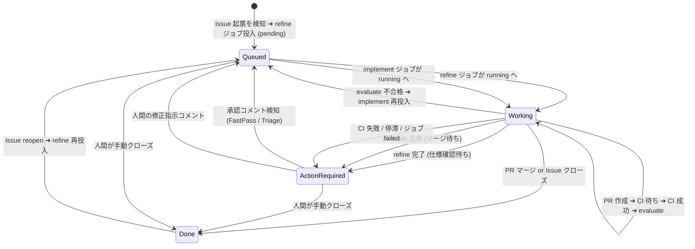
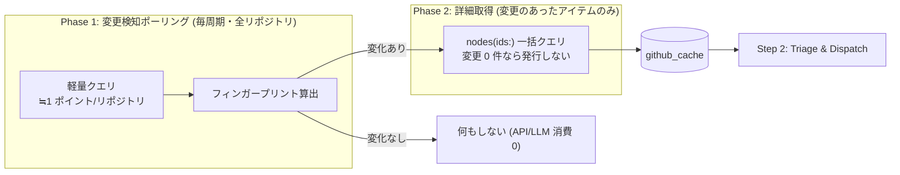
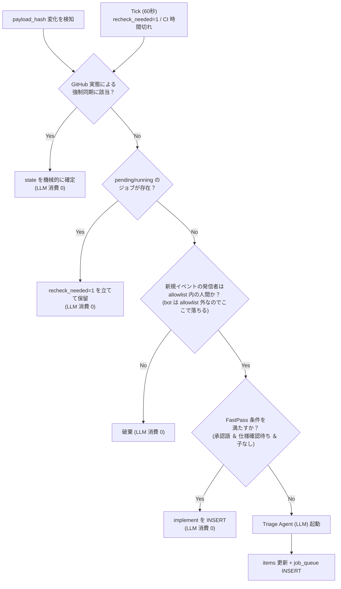
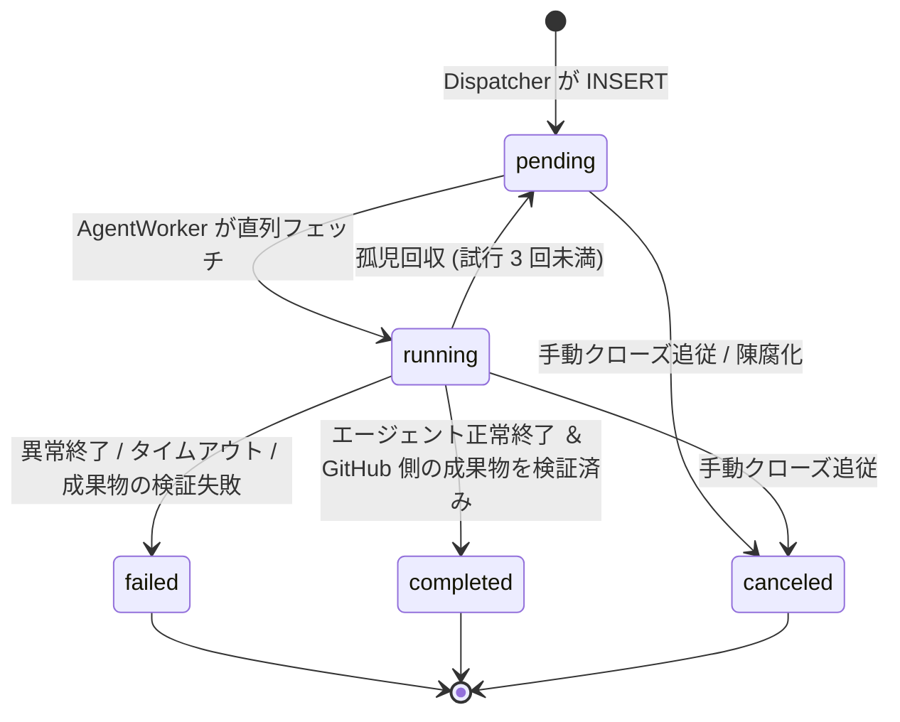
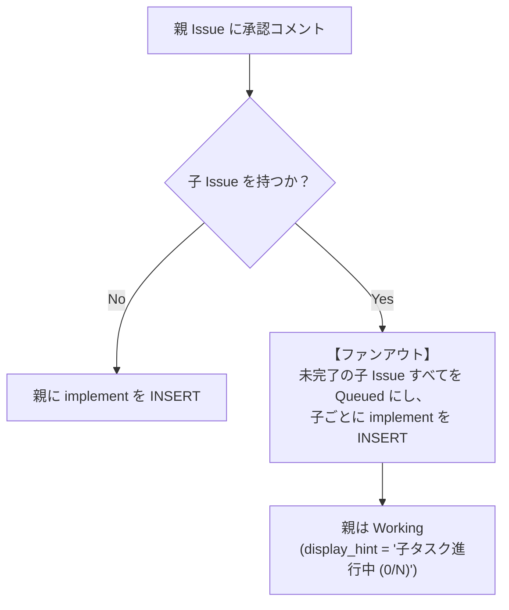

# 実装仕様 (Spec)

前提は [DESIGN.md](../DESIGN.md)、方針は [ARCHITECTURE.md](../ARCHITECTURE.md)、外部制約は [constraints.md](./constraints.md)。

本書は **巻き戻しコストが高い決定だけ**を持つ。スキーマ・値域・書き手・外部との契約がそれにあたる。
閾値やエッジケースの扱いは実装時に決め、**理由はコードのコメントに書く**。本書に理由づけは書かない。

実装が正本のもの: スキーマ `src/store/migrations/`、クエリと fingerprint `src/github/poll.ts` / `detail.ts`、閾値 `src/config.ts` の `DEFAULTS`、設定例 `config.example.yaml`。

---

## 1. 追跡単位

- Issue 起点。`items` の主キーは `(repo, issue_number)`。Issue に紐づかない PR は追跡しない。
- **1 Issue = 1 PR**。PR 本文のクローズキーワードは対象 1 Issue のみ（`idx_items_pr` の UNIQUE 制約）。
  複数 PR が要る規模は Sub-issue に分割する。
- PR の差分は `idx_items_pr` で親 Issue に解決してから扱う。解決先が無い PR は無視。

## 2. 状態

`items.state` は 4 値のみ。`display_hint` は下表で**完全に閉じている**（TypeScript の union 型として実装し、
値域外をコンパイルエラーにする）。

| state | レーン | display_hint |
|---|---|---|
| `ActionRequired` | 🧑 | `仕様確認待ち` `マージ待ち` `助言待ち` `エラー対応待ち` `CI 停滞` `CI 失敗（要判断）` `Issue クローズ確認待ち` `取り下げ確認待ち` `完了確認待ち` `親 Issue の承認待ち` `未着手` `Triage 失敗（要判断）` `中止済み` |
| `Working` | 🤖 | `精緻化中` `実装中` `評価中` `CI 待ち` `CI 未反映` `子タスク進行中 (x/N)` |
| `Queued` | 📦 | `着手待ち` |
| `Done` | ✅ | （終端・既定では非表示） |

- `job_queue` の `pending` が `Queued`、`running` が `Working`。INSERT 直後は必ず `Queued`。
- `blocked_from`（`refine`/`implement`/`evaluate`/空）に `ActionRequired` へ落ちた直前のジョブ種別を記録。
  `助言待ち` 以外へ遷移する際は空にクリアする。
- `Done` のアイテムは Phase 2 と Triage の対象外。例外は Phase 1 で `CLOSED ➔ OPEN` を検知した場合のみ。

### 状態遷移



## 3. 状態の確定（強制同期）

**上から順に評価し、最初に該当した行で確定する（first-match）。** LLM より GitHub の実態が常に優先。

| # | 実態 | 確定 |
|---|---|---|
| 1 | Issue が `CLOSED` | `Done`。`stateReason` で `COMPLETED` / `NOT_PLANNED` を区別して記録。親があれば親の `recheck_needed=1` ＋ 親の `fingerprint=''`。当該アイテムのジョブを `canceled` |
| 2 | PR が `MERGED` ＆ Issue が `CLOSED` | 同上 |
| 3 | PR が `MERGED` ＆ Issue が `OPEN` | `ActionRequired` / `Issue クローズ確認待ち` |
| 4 | PR が `CLOSED`（未マージ） | `pr_number=0`, `branch=''`, `head_sha=''`, `ci_since=NULL` にリセット。`ActionRequired` / `取り下げ確認待ち`。ジョブを `canceled` |
| 5 | Issue が `CLOSED ➔ OPEN`（reopen） | `retry_count` / `blocked_from` をリセットし `Queued`（`refine` 投入） |
| 6 | `triaged=0` ＆ `OPEN` ＆ PR なし ＆ `parent` なし ＆ 起票者が allowlist 内 | `Queued`（`refine` 投入、`triaged=1`、`trigger_key=open:<n>`） |

### 所有権と競合

- 当該アイテムに `pending`/`running` のジョブがある間、**Dispatcher は `items.state`/`display_hint` を書かない**。
  スキップしたら `recheck_needed=1` を立て、ジョブ終端の直後に最優先で再 Triage する。
- ジョブ終端時、`items.state` が既に `Done` なら状態遷移を行わない（`runs` の記録のみ）。
- **`items` の各列の書き手は 1 つ**（ARCHITECTURE 方針9）。
  `items` 行の作成と `parent_*` / `sub_issues_*` / `title` / `head_sha` の更新は **Poller**。
  `state` / `display_hint` / `state_since` / `blocked_from` は **Dispatcher と AgentWorker**（所有権ルールで排他）。
  `ci_since` を `NULL` から設定できるのは **AgentWorker（`implement` 完了時）のみ**。
  Poller は既に `NOT NULL` のものだけ `head_sha` 変化時に更新する。
- `items` の UPDATE は必ず `WHERE version = :version` ＋ `SET version = version + 1`。0 行なら再読み込みしてやり直す。

## 4. CI 判定

**適用は `items.ci_since IS NOT NULL` のアイテムのみ**（Autopilot 自身が作った PR だけが対象）。
**判断は 1 関数に集約する**（呼び出し側から分岐を奪う）。

1. HEAD 一致: `commits[0].oid == headRefOid == items.head_sha`。不一致なら `Working (CI 未反映)`。
2. rollup:

| `statusCheckRollup.state` | 次アクション |
|---|---|
| `SUCCESS` | `evaluate` 投入（`trigger_key = ci:<sha>:SUCCESS`） |
| `PENDING` / `EXPECTED` | `Working (CI 待ち)`。30 分継続で `ActionRequired (CI 停滞)` |
| `FAILURE` / `ERROR` | `retry_count < 5` なら CI ログを載せて `implement` 再投入。超過で `ActionRequired (CI 失敗（要判断）)` |
| `null` | `ci_since` から 10 分は待機。経過後は「CI 未設定」として `evaluate` 投入（`ci:<sha>:NO_CI`） |

`retry_count` の上限は 5（CI 失敗と `evaluate` 不合格で共有）。リセットは
allowlist 内の人間の新規コメント／reopen／`evaluate` 合格／`取り下げ` からの再着手で新規 PR 作成時。

## 5. 収集



- **2 段フェッチ**。Phase 1 で全リポジトリの fingerprint を取り、変化したものだけ Phase 2 で `nodes(ids:)` 一括取得。
- fingerprint 要素 — Issue: `state`,`updatedAt` ／ PR: `state`,`isDraft`,`updatedAt`,`headRefOid`,
  `comments.totalCount`,`reviews.totalCount`,`reviewThreads.totalCount`,`commits[0].oid`,`statusCheckRollup.state`
- Phase 2 の結果は `payload_json` に upsert。`payload_hash` が前回と同一なら Triage を起動しない。
- **OPEN 一覧から消えた PR**: `pr_number > 0` かつ `state != 'Done'` のうち、今周期の Phase 1 の OPEN 一覧に
  現れなかったものを Phase 2 の対象に加える（全ページ取得完了後に判定）。
- カーソルは `cursors` に `sync:owner/repo`。値は**レスポンスの `Date` ヘッダ**基準、`since = 前回 - 5分`。
  Phase 1 と Phase 2 の**両方が成功した後**にのみ前進させる。
- **コールドスタート**: 初回 `since` は 30 日前。作成した全行を `triaged=1` とし、
  `ActionRequired` / `未着手` で登録（PR があれば `pr_number`/`branch`/`head_sha` を埋め、`ci_since` は `NULL`）。
  **Triage を起動せず `job_queue` に一切 INSERT しない。** `last_event_at` は既存コメントの最新時刻。
- **Tick**（60 秒・GitHub API を呼ばない）: CI Grace / CI 停滞 / `recheck_needed=1` / `lease_until < now` を評価。
- GraphQL の `errors` が返ったら `github_cache` を更新せず周期ごとスキップ。

## 6. Triage

LLM を呼ぶのは最下段のみ。それまでは機械的に落とす。



- **新規イベント** = 前回処理以降に増えた Issue コメント／PR レビュー／インラインコメント。
  カーソルは `last_event_at`（`createdAt`/`submittedAt`/`reviewThreads.nodes.comments.createdAt` の最大）＋
  `last_event_id`（同時刻の tie-break、`databaseId`）。**GraphQL の `id` は順序を持たないので使わない。**
  新規イベント 0 件なら LLM を呼ばず機械的規則だけで処理する。
- **追跡可否と駆動可否は別**。監視対象リポジトリの Issue は起票者に関係なく `items` に登録する。
  ジョブの起動根拠になるのは allowlist 内の人間の発言だけ。
- **bot は専用アカウント**。`bot_login` は `viewer { login }` で起動時に自動取得。
  `author.login == bot_login` の発言は無条件で破棄。`doctor` は bot が allowlist 外であることを検証し、
  違反したら**起動を拒否**する。
- **FastPass**（以下を全て満たすときのみ LLM を介さず `implement` 投入）:
  `^(ok|了解|承認|進めて|お願いします|やって|go)[。！!.]*$/iu` に trim 後完全一致 ＆
  `state == ActionRequired` ＆ `display_hint == '仕様確認待ち'` ＆ `sub_issues_total == 0`。
- **Triage Agent は純関数**。スナップショット JSON を stdin、判定 JSON を stdout。
  ワークスペースを持たず、`GH_TOKEN` も `bypassPermissions` も渡さない。呼び出しは直列。
  入力は新規イベント全文＋過去履歴 直近 5 件（各 1,000 字）＋本文 各 4,000 字に切り詰める。
  直近の `runs` 1 件（`job_type`/`result`/`summary`/`next_context`）を必ず含める。
  非 allowlist 由来のテキストは `<untrusted_content>` で囲む。
- 出力 `{state, display_hint, next_job, job_context, reason}` は検証してから適用。
  値域違反・整合性違反・強制同期との矛盾があれば `next_job=none` に丸める（**実態を優先**）。
- 失敗時のカーソル:

| 事象 | カーソル | items |
|---|---|---|
| 正常 | 進める | 適用。`triage_fail_count=0` |
| 出力検証 NG | **進める** | 変更せず `triage_fail_count += 1` |
| 実行エラー | **進めない** | `triage_fail_count += 1`、`recheck_needed=1` で次周期に再試行 |
| `triage_fail_count >= 3` | 進める | `ActionRequired (Triage 失敗（要判断）)` |

- `last_event_at`/`last_event_id` の更新は**ジョブ INSERT と同一トランザクション**。
- **冪等性**: `idx_job_dedupe`（同一アイテム・同種の未完了ジョブを 1 つに）＋ `trigger_key`。
  同じ `trigger_key` で**終端状態（`completed`/`failed`/`canceled`）**のジョブがあれば再投入しない。

| 発火元 | `trigger_key` |
|---|---|
| 人間のコメント／レビュー／インラインコメント | `comment:<id>` / `review:<id>` / `review_comment:<id>` |
| CI 結果 | `ci:<sha>:<SUCCESS\|FAILURE\|NO_CI>` |
| `evaluate` 不合格 | `verdict:<job_id>` |
| 親からのファンアウト | `fanout:<parent>:<comment_id>` |
| Issue 起票 / reopen | `open:<n>` / `reopen:<updatedAt>` |

## 7. キュー



- **同一リポジトリは 1 件ずつ。リポジトリ横断で FIFO。** 取得と更新は単一文で行う（TOCTOU 回避）。

```sql
UPDATE job_queue SET status='running', lease_until=…, started_at=…, worker_pid=:pid, worker_boot_id=:boot
WHERE id = (SELECT id FROM job_queue q WHERE q.status='pending'
    AND (SELECT COUNT(*) FROM job_queue WHERE status='running') < :max_parallel
    AND NOT EXISTS (SELECT 1 FROM job_queue r WHERE r.repo=q.repo AND r.status='running')
  ORDER BY q.id ASC LIMIT 1)
RETURNING id, repo, issue_number, job_type, job_context;
```

- 取得と同一トランザクションで `items` を `Working` に遷移させ、`runs` に `result='RUNNING'` で INSERT する。
- **CI 待ちはキューを占有しない**。`implement` は PR 作成時点で `completed`。
- **リースは生存信号**（実行タイムアウトとは別物）。初期値 5 分、実行中 60 秒ごとに +5 分。
  延長条件に `worker_pid` ＋ `worker_boot_id` を含める（PID は再利用される）。
- **多重起動禁止**: `$AUTOPILOT_HOME/autopilot.lock` を `O_EXCL` で作成し PID と `boot_id` を書く。
  既存があれば `process.kill(pid, 0)` で生存確認し、死んでいれば奪う。
- **孤児回収**: 起動時の `running` は全て前回の残骸。`lease_until < now` も同様。
  `attempt_count >= 2` なら `failed`、そうでなければ `pending` に戻す。`runs` も `CANCELED`/`FAIL` で終端化する。
- **中止**: `autopilot cancel` は `job_queue.status` を書くだけ。プロセス終了と `items` 更新は `autopilot run` 側が
  ハートビートで検知して行う（PID 再利用による誤 kill を避ける）。最大 60 秒の遅延。

## 8. エージェント契約

**`exit 0` を信用しない。GitHub 側に成果物があることを確認して初めて成功とみなす。**

| ジョブ | 成功条件 | 完了後 |
|---|---|---|
| `refine` | exit 0 ＆ 結果ファイル妥当 ＆ bot の Issue コメントが実行前の最大 `databaseId` より新しい | `ActionRequired (仕様確認待ち)` |
| `implement`（新規 PR） | exit 0 ＆ 結果ファイル妥当 ＆ PR が存在し本文に `Closes #<n>` を含む | `Working (CI 待ち)` |
| `implement`（既存 PR） | exit 0 ＆ 結果ファイル妥当 ＆ `head_sha` が実行前から変化 | `Working (CI 待ち)` |
| `evaluate`（`merge_ready`） | exit 0 ＆ `verdict` ＆ bot の PR コメントが新しく存在 | `ActionRequired (マージ待ち)` |
| `evaluate`（`needs_work`） | exit 0 ＆ `verdict` ＆ `next_context`（**コメント不要・通知を出さない**） | `Queued`（`implement` 再投入） |
| 共通 `status=="blocked"` | ＆ bot の選択肢コメントが **Issue 側**に存在 | `ActionRequired (助言待ち)` |

- **実行前スナップショット**をエージェント起動直前に GitHub から取得する（DB からではない）。
  Issue コメントの最大 `databaseId` ／ PR コメントの最大 `databaseId` ／ `head_sha`（既存 PR がある場合）。
  照合は `author.login == bot_login` ＋ `databaseId >` スナップショット。**時刻で照合してはならない。**
  新規 PR は「OPEN な PR のうち bot 作成かつ本文に `Closes #<n>` を含むもの」を検索して特定する。
- 成果物検証は反映遅延を見込み **2 秒間隔・最大 15 秒**リトライしてから `failed` と判定する。
- **`evaluate` の実行前 HEAD 検証**: ワークスペース初期化直後、HEAD の SHA が `trigger_key` の SHA と一致するか確認する。
  不一致なら陳腐化として `canceled`（`runs.result='CANCELED'`）。`trigger_key` が SHA を含まない形式なら検証をスキップ。
- **結果ファイル** `$AUTOPILOT_HOME/run/<job_id>.result.json`（プロンプトには展開済み絶対パスを書く）:
  `{status: ok|blocked, verdict: merge_ready|needs_work, summary, next_context}`。
  欠落・不正なら `exit 0` でも `failed`。`summary`/`next_context` は `runs` に保存する。
  **合否をコメント本文のマーカーで渡さない。**
- **ワークスペース** `$AUTOPILOT_HOME/workspaces/<owner>/<repo>/` にリポジトリごと 1 クローンのみ。
  実行直前に必ず `fetch --prune` ➔ `rebase/merge/cherry-pick --abort`（独立に実行）➔ `reset --hard` ➔ `clean -fd`
  ➔ `checkout -B $TARGET_BRANCH origin/$TARGET_BRANCH` ➔ `reset --hard` ➔ `clean -fd`。`-x` は付けない。
  `$TARGET_BRANCH` は `refine`/`implement`（新規）が既定ブランチ、`implement`（修正）/`evaluate` が `items.branch`。
- **プロンプト**: 識別情報は全て本文に埋め込む（環境変数にしない）。パスは展開済み絶対パス。
  認証情報だけは環境変数で渡し、**Worker と同一の bot トークンに固定**する。
  `agy` は一時ファイル参照＋`--print-timeout`（ワーカー上限の 30 秒手前）。
  品質ゲート `.agents/autopilot-gate.md` は**既定ブランチから読む**（`git show origin/<base>:…`）。
- **与えない権限**: PR をマージしない／Issue・PR をクローズしない／1 PR で複数 Issue をクローズしない／
  Draft PR を作らない／既定ブランチへ直接 push しない／force push は自分の作業ブランチのみ。
- ログは `$AUTOPILOT_HOME/logs/<repo>/<issue>/<job_id>.log`。ログと `job_context` は
  既知のトークン形式（`ghp_`,`gho_`,`github_pat_`,`sk-ant-`）をマスクしてから保存する。

## 9. 親子 Issue

- `Issue.parent` / `subIssues` / `subIssuesSummary` はプレビューヘッダ不要（実測確認済み）。
  `subIssues` の `stateReason` と `repository { nameWithOwner }` を省略しない。
- **`subIssuesSummary.completed` は却下（`NOT_PLANNED`）も数える。** 完了報告では内訳を分けて提示する。
- 子は `refine` 済みで作成する。**Poller が**「`author.login == bot_login` かつ `parent` を持つ」Issue を
  `ActionRequired` / `親 Issue の承認待ち` / `triaged=1` で登録する（二重 `refine` 防止）。
  確認コメントは親に 1 通だけ投稿する。


- **親への「OK」はファンアウト**（未完了の子すべてに `implement` を INSERT）。FastPass は通さない。
  対象は**監視対象リポジトリの子のみ**。子が別リポジトリなら子のリポジトリのキューに入る。
- 親は `sub_issues_total > 0` かつ未完了の子がある間 `Working (子タスク進行中 (x/N))`。
  `sub_issues_total > 0 AND sub_issues_completed == sub_issues_total` で `ActionRequired (完了確認待ち)`。
  **親 Issue の自動クローズは行わない。**
- **深さは 1 段まで**（子は分割しない）。

## 10. Dashboard

- `autopilot run` 内に Hono を同居させる。**書き込み API を持たない。**
  待ち受けは `dashboard.host`（既定 `127.0.0.1`）と `dashboard.port`。
  認証は持たないので、`0.0.0.0` にするのは信頼できるネットワークに限る
  （読み取り専用なので影響は Issue の題名と状態の開示まで）。
- `GET /api/state` が 3 レーンと `health` を返す。フロントは 3〜5 秒間隔でポーリング。
- レーンは `items.state` をそのまま使う。`display_hint` は保存済みの文字列をそのまま描画する
  （Dashboard 側で状態を再解釈しない）。`title` は `items.title` を使い `payload_json` をパースしない。
- 並び順は `ActionRequired` が `state_since` 昇順、他は `job_queue.id` 昇順。**`updated_at` で並べない。**
- `queue_position`（全リポジトリ横断の実行順）は API が計算する。**`display_hint` に順位を保存しない。**
- `health` の値（レートリミット残量・`last_poll_at`・`degraded`）は DB ではなく**プロセス内メモリ**に持つ。
- `autopilot status` は `/api/state` を取得して整形表示する。未起動なら exit 1。

## 11. 未実装（実際に踏んだら実装する）

初回スコープから外す。仕様は書かない。**踏んだ時点で、方針 10 項目との整合だけ確認して実装する。**

- Draft PR を人間が作った場合の扱い（エージェントには作成を禁止済み）
- コールドスタート時の PR 付き Issue の自動追跡（現在は `未着手` で人間待ち）
- 監視対象外リポジトリにある子 Issue の完了追従
- 子 Issue 50 件超（`分割過多`）／親子の循環参照／全子タスクが `NOT_PLANNED`
- Sub-issues API が使えなくなった場合のタスクリスト方式フォールバック
- レートリミット低下時の自動抑制（`remaining < 1000` で 300 秒、`< 200` で停止）
- コメント 20 件超の遡り取得
